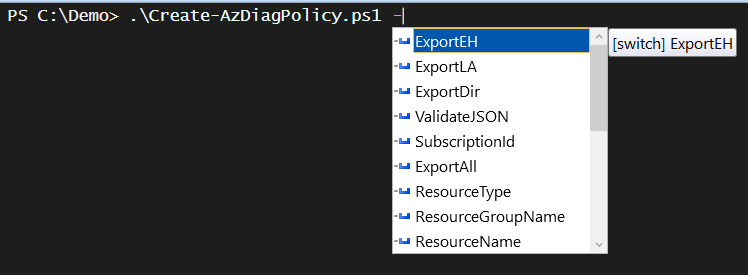
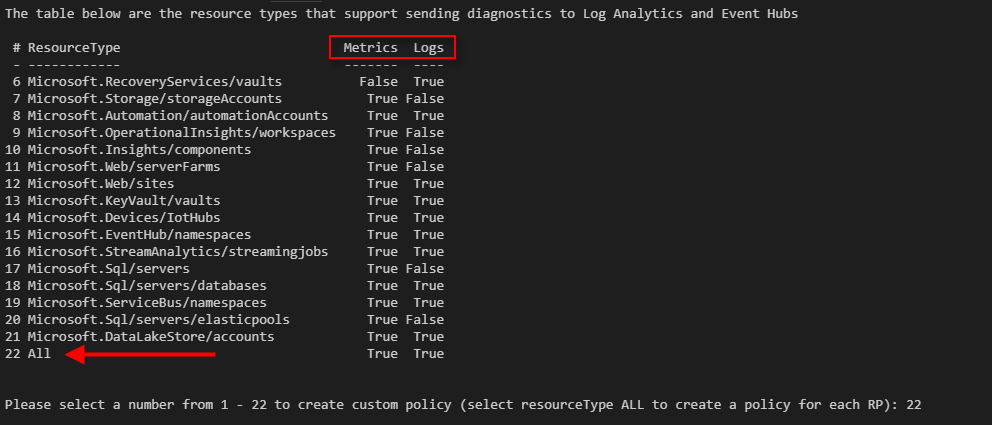
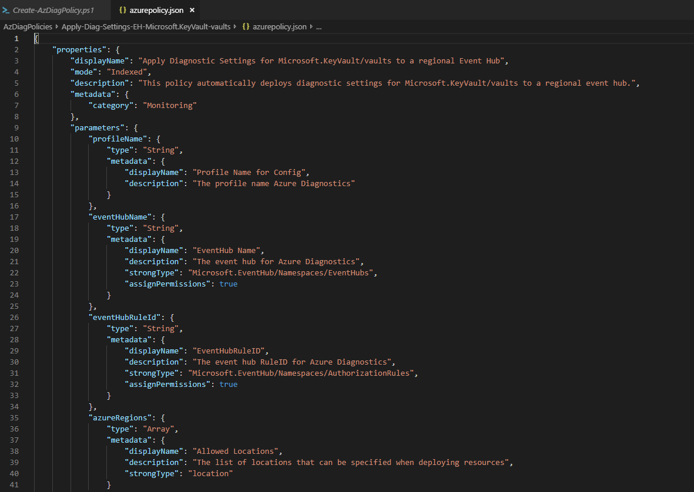
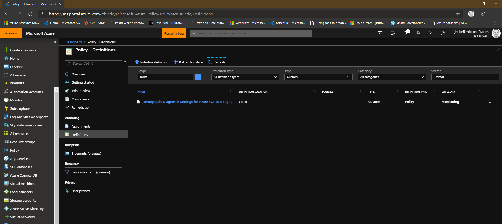
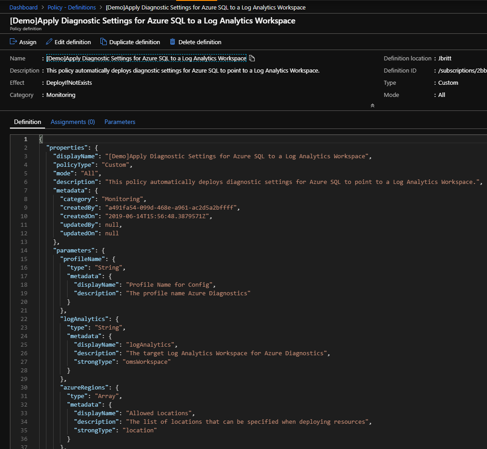

# Azure Diagnostics Policy Generator

# OVERVIEW OF CREATE-AZDIAGPOLICY.PS1

**Create-AzDiagPolicy.ps1** is a script that creates Azure Custom Policies supporting Azure resource types that support Azure Diagnostics logs and metrics.  Policies can be created for both Event Hub and Log Analytics sink points with this script.  In addition, this script will only provide the policies for the resource types you have within the Azure Subscription that you provide either via the cmdline parameter -SubscriptionId or by selecting a subscription from the menu provided.  

* Optionally you can supply a tenant switch to scan your entire Azure AD Tenant.  

    > **Note**:
    > Please use caution when using this option as it will take quite some time to scan thousands of subscriptions!


## Parameters
The following cmdline parameters are available with this script to help customize the experience and remove all prompting during execution.



Parameter details are contained within the synopsis of the script for more information. From the PowerShell console type the following to get a full detailed listing of parameters and their use.

```azurepowershell-interactive
  get-help .\Create-AzDiagPolicy.ps1 -Parameter * 
```
## Executing the Script
Examples of how to use the script can be found by executing the following from the PowerShell console

```azurepowershell-interactive
  get-help .\Create-AzDiagPolicy.ps1 -examples 
```
### Exporting Event Hub and Log Analytics Policies
The following parameters will export Event Hub and Log Analytics Policies for Azure Diagnostics to a relative path of **.\PolicyExports** and validate all JSON export content as a last step.

```azurepowershell-interactive
  .\Create-AzDiagPolicy.ps1 -ExportEH -ExportLA -ExportDir .\PolicyExports -ValidateJSON -SubscriptionId "<SUBID>"
```


You are then prompted with a list of resourceTypes to choose from. You can select “22” below to export all policies for all resourceTypes detected or you can simply select the one you care about.  You can also provide that on cmdline via parameter (-ExportAll).



Once you've selected your option and pressed enter, the details of the export / creation of Azure Policy files and optional validation is displayed.


The results of this export represent a series of subfolders for each ResourceType and Policy Type you have opted to create.


- azurepolicy.json : This is the full json file needed to create a policy within Azure
- azurepolicy.parameters.json : This file represents the parameters for your policy 
- azurepolicy.rules.json: This file has all the rules that your policy is leveraging to go against Azure for compliance evaluation 

    > **Note**:
    > Each of the above files are required and leveraged to create a custom Azure Policy in Azure via CLI or PowerShell (shown next)

Opening up and reviewing the **azurepolicy.json** artifact will provide you details on the structure and properties of the newly created custom Azure Policy.


## Importing the Custom Policies Into Azure Policy
 Next, the below shows you an example of how you can leverage the created policy artifacts to import directly into Azure Policy.


Example script snippit below
```azurepowershell-interactive
Select-AzSubscription -SubscriptionName jbritt
$definition = New-AzPolicyDefinition -Name "apply-diagnostic-setting-azsql-loganalytics" `
 -Metadata '{ "category":"Monitoring" }' `
 -DisplayName "[Demo]Apply Diagnostic Settings for Azure SQL to a Log Analytics Workspace" `
 -description "This policy automatically deploys diagnostic settings for Azure SQL to point to a Log Analytics Workspace." `
 -Policy '.\PolicyExports\Apply-Diag-Settings-LA-Microsoft.Sql-servers-databases\azurepolicy.rules.json' `
 -Parameter '.\PolicyExports\Apply-Diag-Settings-LA-Microsoft.Sql-servers-databases\azurepolicy.parameters.json' 
$definition
```
  > **Note**:
  > Pay close attention to the **-Metadata** parameter indicating the proper way to set a category in Azure Policy so it can be searched and sorted once imported.

## Reviewing Your Imported Policy
Once you've imported your custom policy to the Azure Policy environment, you can located it by going to **Azure Policy / Definitions** and searching on the **DisplayName** you provided in the previous example.


Finally - you can select the policy to review the actual contents (JSON) within and how it is organized.


From here you can assign this individual policy to a scope (Subscription/Management Group / Resource Group) to enforce it within your environment.

## See also

- [PowerShell Gallery (https://aka.ms/CreateAzDiagPolicies)](https://aka.ms/CreateAzDiagPolicies)
- [Tutorial: Create and manage policies to enforce compliance](https://docs.microsoft.com/en-us/azure/governance/policy/tutorials/create-and-manage)

